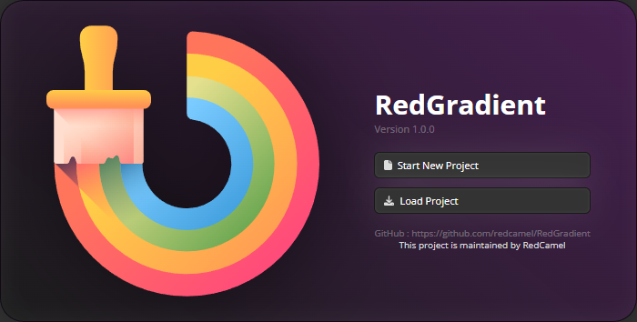
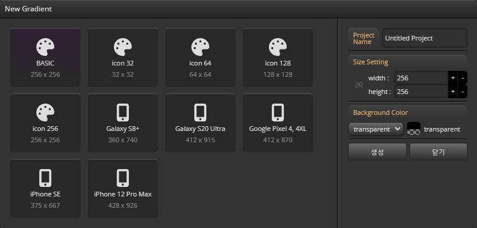
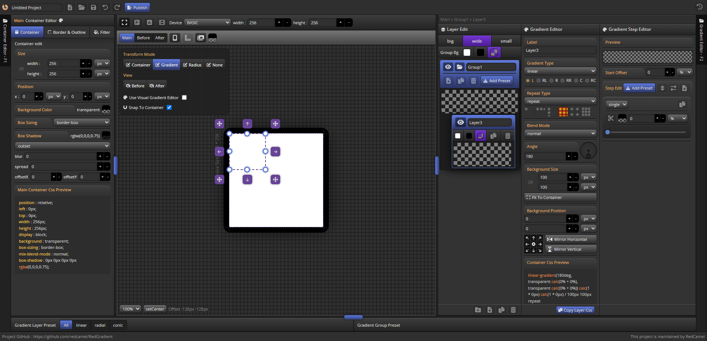

import ReactPlayer from 'react-player'
const t0 = require('@site/static/video/newProject.mp4').default

# Create your first Project
<ReactPlayer
	playing
	controls
	url={t0}
	loop
	width={'100%'}
	height={'100%'}
	playbackRate={1.5}
/>

### 프로젝트 관리

- ### 두가지 프로젝트 시작 모드를 지원합니다.
	- ```새로운 프로젝트```로 시작하기
	- ```기존 프로젝트```로 시작하기

### 새 프로젝트 만들기

- #### 프로젝트 생성 옵션
	- 프로젝트 ```이름``` 설정
	- 가상 디바이스 크기 ```프리셋```
	- 가상 디바이스 ```크기``` 설정
	- 초기 ```background``` 컬러


### Main UI

