import TOCInline from '@theme/TOCInline';

# Border & Outline Panel

<hr/>

Border & Outline Panel은 Css가 표현될 Dom의 border와 outline 스타일을 편집을 위한 UI의 모음입니다.


<hr/>

<TOCInline toc={toc}/>

<hr/>

### outline
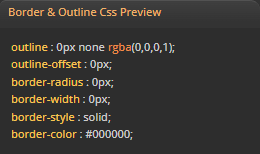

- 컨테이너의 border와 outline style에 대한 css를 preview합니다.

<hr/>

## border Mode
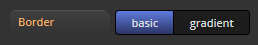

- border는 두가지 모드를 지원합니다.
  - **basic Mode** : 일반적인 단색 기반의 border
  - **gradient Mode** : border-image(색상이) gradient 결과물로 이루어진 모드

		:::info
		- 단일 : gradient layer step 편집기를 제공합니다.
		:::


<hr/>

## border Common UI
- basic Mode와 gradient Mode 공용 UI 모음
### border radius
- border-radius 스타일 편집기 입니다.
- ```solo``` & ```merge``` Mode를 지원합니다.

	|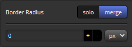|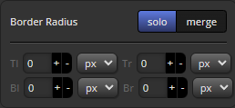|
	|:--|--:|
	|Merge Mode|Solo Mode|

<hr/>

### border width
- border-width 스타일 편집기 입니다.
- ```solo``` & ```merge``` Mode를 지원합니다.

	|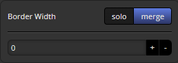|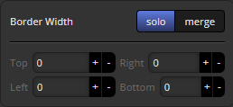|
	|:--|--:|
	|Merge Mode|Solo Mode|

<hr/>

## border Basic UI
- basic Mode 전용 UI 모음

### border color
- border-color 스타일 편집기 입니다.
- ```solo``` & ```merge``` Mode를 지원합니다.

	|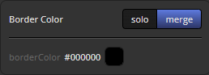|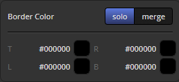|
	|:--|--:|
	|Merge Mode|Solo Mode|

<hr/>


### border style
- border-style 스타일 편집기 입니다.
- ```solo``` & ```merge``` Mode를 지원합니다.

	|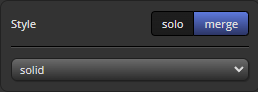|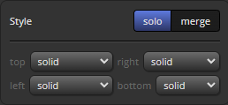|
	|:--|--:|
	|Merge Mode|Solo Mode|

<hr/>


## border - gradient
- gradient Mode 전용 UI 모음
### border image outset
- border-image-outset 스타일 편집기 입니다.
- ```solo``` & ```merge``` Mode를 지원합니다.
- ```border-image-outset```의 자세한 스펙은 [mdn](https://developer.mozilla.org/ko/docs/Web/CSS/border-image-outset)에서 확인하세요.

	|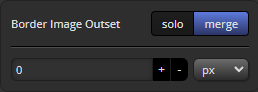|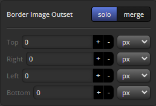|
	|:--|--:|
	|Merge Mode|Solo Mode|

<hr/>

### border image slice
- border-image-slice 스타일 편집기 입니다.
- ```solo``` & ```merge``` Mode를 지원합니다.
- ```border-image-slice```의 자세한 스펙은 [mdn](https://developer.mozilla.org/ko/docs/Web/CSS/border-image-slice)에서 확인하세요.

	|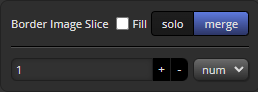|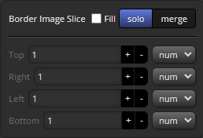|
	|:--|--:|
	|Merge Mode|Solo Mode|

<hr/>

<hr/>

### border image repeat
- border-image-repeat 스타일 편집기 입니다.
	-	**지원타입**
		- stretch
		- repeat
		- round
		- space

- ```border-image-repeat```의 자세한 스펙은 [mdn](https://developer.mozilla.org/ko/docs/Web/CSS/border-image-repeat)에서 확인하세요.

	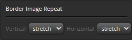

<hr/>

### border gradient step editor
- border-image에 그려질 그라디언트를 편집할 수 있습니다.

	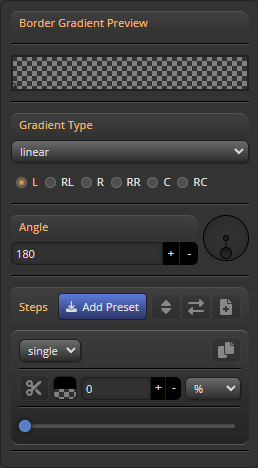

<hr/>


