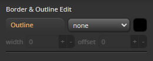

import Tabs from '@theme/Tabs';
import TabItem from '@theme/TabItem';
import TOCInline from '@theme/TOCInline';

# Border & Outline Panel

<hr/>

Border & Outline Panel은 Css가 표현될 Dom의 ```border와 outline``` 스타일을 편집을 위한 UI의 모음입니다.


<hr/>

<TOCInline toc={toc}/>

<hr/>

### Outline


- 컨테이너의 outline 스타일 편집기 입니다.

<hr/>

## Border Mode


- border는 두가지 모드를 지원합니다.

	- **basic Mode** : 일반적인 단색 기반의 border
	- **gradient Mode** : border-image(색상이) gradient 결과물로 이루어진 모드


:::info
- 단일 : gradient layer step 편집기를 제공합니다.
:::


<hr/>

## Border Common UI
- basic Mode와 gradient Mode 공용 UI 모음
### Border radius
- border-radius 스타일 편집기 입니다.
- ```merge``` & ```solo``` Mode를 지원합니다.
<Tabs>
	<TabItem value="merge" label="merge mode" default>
		
	</TabItem>
	<TabItem value="solo" label="solo mode">
		
	</TabItem>
</Tabs>


<hr/>

### Border width
- border-width 스타일 편집기 입니다.
- ```merge``` & ```solo``` Mode를 지원합니다.
<Tabs>
	<TabItem value="merge" label="merge mode" default>
		
	</TabItem>
	<TabItem value="solo" label="solo mode">
		
	</TabItem>
</Tabs>

<hr/>

## border Basic UI
- basic Mode 전용 UI 모음

### Border color
- border-color 스타일 편집기 입니다.
- ```merge``` & ```solo``` Mode를 지원합니다.
<Tabs>
	<TabItem value="merge" label="merge mode" default>
		
	</TabItem>
	<TabItem value="solo" label="solo mode">
		
	</TabItem>
</Tabs>

<hr/>


### Border style
- border-style 스타일 편집기 입니다.
- ```merge``` & ```solo``` Mode를 지원합니다.
<Tabs>
	<TabItem value="merge" label="merge mode" default>
		
	</TabItem>
	<TabItem value="solo" label="solo mode">
		
	</TabItem>
</Tabs>

<hr/>


## border - gradient
- gradient Mode 전용 UI 모음
### Border image outset
- border-image-outset 스타일 편집기 입니다.
- ```merge``` & ```solo``` Mode를 지원합니다.
- ```border-image-outset```의 자세한 스펙은 [mdn](https://developer.mozilla.org/ko/docs/Web/CSS/border-image-outset)에서 확인하세요.
<Tabs>
	<TabItem value="merge" label="merge mode" default>
		
	</TabItem>
	<TabItem value="solo" label="solo mode">
		
	</TabItem>
</Tabs>

<hr/>

### Border image slice
- border-image-slice 스타일 편집기 입니다.
- ```merge``` & ```solo``` Mode를 지원합니다.
- ```border-image-slice```의 자세한 스펙은 [mdn](https://developer.mozilla.org/ko/docs/Web/CSS/border-image-slice)에서 확인하세요.
<Tabs>
	<TabItem value="merge" label="merge mode" default>
		
	</TabItem>
	<TabItem value="solo" label="solo mode">
		
	</TabItem>
</Tabs>

<hr/>

<hr/>

### Border image repeat
- border-image-repeat 스타일 편집기 입니다.
	-	**지원타입**
	- stretch
	- repeat
	- round
	- space

- ```border-image-repeat```의 자세한 스펙은 [mdn](https://developer.mozilla.org/ko/docs/Web/CSS/border-image-repeat)에서 확인하세요.

 

<hr/>

### Border gradient step editor
- border-image에 그려질 그라디언트를 편집할 수 있습니다.

 

<hr/>


## css preview
 

- 컨테이너의 border와 outline style에 대한 css를 preview합니다.