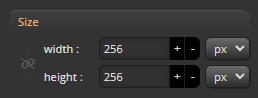
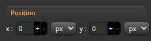
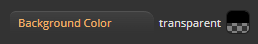
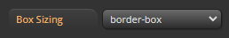
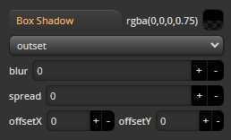
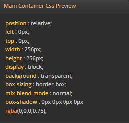

import TOCInline from '@theme/TOCInline';

# Container Panel

<hr/>

Container Panel은 ```Css가 표현될 Dom``` 스타일을 편집을 위한 UI의 모음입니다.


:::info
패널내 모든 에디트 UI는 현재 활성화된 Viewpor window내의 타겟 컨테이너를 편집합니다.
:::

:::info
단축키 : ```F1``` 키를 통해 ```on/off``` 할 수 있습니다.
:::
<hr/>

<TOCInline toc={toc}/>

<hr/>


### Size


- 컨테이너의 사이즈를 설정합니다.

:::info
%단위를 사용할경우 가상 Device사이즈 대비 비율로 표현됩니다.
:::


<hr/>

### Position


- 컨테이너의 위치를 설정합니다.

:::info
%단위를 사용할경우 가상 Device사이즈 대비 비율로 표현됩니다.
:::

<hr/>

### Background color


- 컨테이너의 배경컬러를 지정합니다.

<hr/>

### Box sizing


- 컨테이너의 box-sizing 모델을 설정합니다.

<hr/>

### Box shadow


- 컨테이너의 box-shadow를 설정합니다.

<hr/>

### Css preview


- 컨테이너 패널의 현재 css를 미리봅니다.

<hr/>


