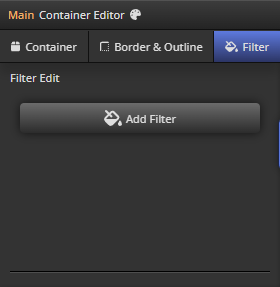
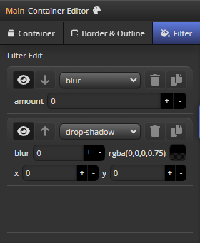
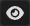
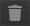
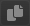

import TOCInline from '@theme/TOCInline';

# Filter Panel

<hr/>

Filter Panel은 Css가 표현될 Dom의 ```filters``` style을 편집하기 위한 패널입니다.




<hr/>

<TOCInline toc={toc}/>

<hr/>


## Filter Item UI
- ###   Visible
	- 필터의 ```Visible``` 여부를 설정합니다.
	- ```off``` 상태시 Viewport Window내에 적용되지 않으며 결과 Css도 생성되지 않습니다.


<hr/>

- ###  Delete
	- Click시 해당 필터를 ```삭제``` 합니다.


<hr/>

- ###  Duplicate
	- Click시 해당 필터를 ```복제``` 합니다.


<hr/>

## 지원필터
css에서 지원하는 모든 필터를 지원합니다.

 - blur
 - brightness
 - contrast
 - drop-shadow
 - grayscale
 - hue-rotate
 - invert
 - opacity
 - saturate
 - sepia

<hr/>

```css filter``` 에 대한 자세한 스펙은 [mdn](https://developer.mozilla.org/ko/docs/Web/CSS/filter)에서 확인하세요.

<hr/>
