import TOCInline from '@theme/TOCInline';

# Gradient Property Panel

<hr/>

Gradient Property Panel은 선택한 ```layer(gradient)의 속성```에 대한 편집기능을 제공합니다.

:::info
하나의 layer는 하나의 gradient와 동일 합니다.
:::

<hr/>

<TOCInline toc={toc}/>

<hr/>

### Label
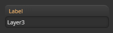

레이어의 라벨을 수정합니다.
<hr/>

### Gradient type
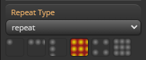

그라디언트 ```타입```을 설정합니다.

- #### 지원타입
	- linear-gradient
	- repeating-linear-gradient
	- radial-gradient
	- repeating-radial-gradient
	- conic-gradient
	- repeating-conic-gradient

<hr/>

### Repeat type
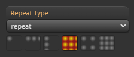

그라디언트 ```반복 타입```을 설정합니다.

- #### 지원타입
	- no-repeat
	- repeat-x
	- repeat-y
	- repeat
	- space
	- round

<hr/>

### Blend mode
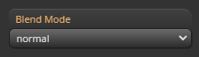

그라디언트 레이어의 ```블렌딩 타입```을 설정합니다.

- #### 지원타입
  - normal
  - multiply
  - screen
  - overlay
  - darken
  - lighten
  - color-dodge
  - color-burn
  - hard-light
  - soft-light
  - difference
  - exclusion
  - hue
  - saturation
  - color
  - luminosity

<hr/>

### Angle (linear, conic 전용)
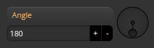

그라디언트 ```angle```을 설정합니다.


<hr/>

### Ending shape (radial 전용)
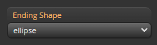

그라디언트 ```ending-shape```을 설정합니다. ```ending-shape```의 자세한 스펙은 [mdn](https://developer.mozilla.org/en-US/docs/Web/CSS/gradient/radial-gradient)에서 확인하세요.

- #### 지원타입
   - ellipse
   - circle

<hr/>

### Size type (radial 전용)
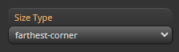

radial gradient의 ```size``` 타입 을 설정합니다. ```size```의 자세한 스펙은 [mdn](https://developer.mozilla.org/en-US/docs/Web/CSS/gradient/radial-gradient)에서 확인하세요.

- #### 지원타입
  - farthest-corner
	- farthest-side
	- closest-corner
	- closest-side

<hr/>

### At (radial, conic 전용)
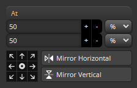

gradient의 ```중심값```을 설정합니다.

- #### Helper UI
  - ```중심값```을 ```9개의 프리셋 위치```로 즉시 설정 할 수 있습니다.

   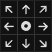

	- ```중심값```의 위치를 ```좌우/상하 반전```할 수 있습니다.

		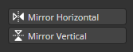

:::info
- px : ```절대적인``` 위치입니다.
- % : 그라디언트  ```크기에 비례```하는 위치입니다.
:::

<hr/>

### Background size
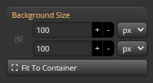

gradient의 사이즈를 설정합니다.

:::info
- px : ```절대적인``` 사이즈입니다.
- % : 컨테이너 ```크기에 비례```하는 사이즈입니다.
:::

<hr/>

### Background position
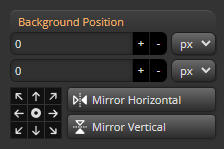

gradient의 ```위치```를 설정합니다.

- #### Helper UI
	- 컨테이너내 그라디언트의 ```위치```를 ```9개의 프리셋 위치```로 즉시 설정 할 수 있습니다.

	

	- 컨테이너내 그라디언트의 ```위치```를 ```좌우/상하 반전```할 수 있습니다.

	

:::info
- px : ```절대적인``` 위치입니다.
- % : 컨테이너 ```크기에 비례```하는 위치입니다.
	-	gradient 타입에 따라 계산법이 다릅니다.
:::
<hr/>

### Css preview
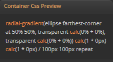

해당 레이어의 ```계산된 css```를 확인할 수 있습니다.

<hr/>