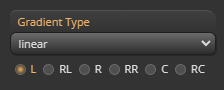

import TOCInline from '@theme/TOCInline';

# Gradient Property Panel

Gradient Property Panel은 선택한 layer(gradient)의 속성에 대한 편집기능을 제공합니다.

하나의 layer는 하나의 gradient와 동일 합니다.

<TOCInline toc={toc}/>

### label
레이어의 라벨을 수정합니다.

### gradient type

그라디언트 타입을 설정합니다.

- #### 지원타입
	- linear-gradient
	- repeating-linear-gradient
	- radial-gradient
	- repeating-radial-gradient
	- conic-gradient
	- repeating-conic-gradient

### repeat type

그라디언트 반복 타입을 설정합니다.

- #### 지원타입
	- no-repeat
	- repeat-x
	- repeat-y
	- repeat
	- space
	- round

### blend mode

그라디언트 레이어의 블렌딩 타입을 설정합니다.

- #### 지원타입
- TODO
- TODO

### angle

그라디언트 angle을 설정합니다.

### ending shape (radial 전용)

그라디언트 endingShape 타입을 설정합니다.

- #### 지원타입
- TODO
- TODO

### size type (radial 전용)

radial gradient의 size 타입을 설정합니다.

- #### 지원타입
- TODO
- TODO

### at (radial, conic 전용)

gradient의 중심값을 설정합니다.

### background size

gradient의 사이즈를 설정합니다.

- #### 지원타입
	- px : 절대적인 사이즈입니다.
	- % : 컨테이너 크기에 비례하는 사이즈입니다.

### background position

gradient의 위치를 설정합니다.

- #### 지원타입
	- px : 절대적인 위치입니다.
	- % : 컨테이너 크기에 비례하는 위치입니다.
		-	gradient 타입에 따라 계산법이 다릅니다.

