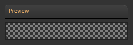
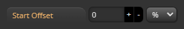
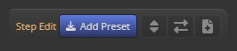
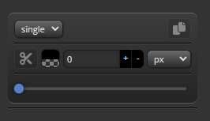

import TOCInline from '@theme/TOCInline';


# Gradient Step Panel

<hr/>

Gradient Step Panel은 선택한 layer(gradient)의 ```step```에 대한 편집기능을 제공합니다.
:::info
* layer는 ```step 리스트```로 구성됩니다.
:::

<hr/>


<TOCInline toc={toc}/>

<hr/>

## preview


그라디언트 ```step```을 linear-gradient 형태로 미리볼수 있습니다.


<hr/>

## start offset


그라디언트가 실제 적용될때 ```시작 스텝```에 대한 ```오프셋값```을 설정합니다.
:::info
* 프리뷰에서는 적용되지 않습니다.
:::


<hr/>

## step helper


```step layer``` 편집을 위한 헬퍼 모음입니다.


<hr/>

## step layer


```step value``` 설정 레이어
 - step의 ```색상```, ```위치```, ```위치 유닛```을 편집할 수 있습니다.
 - ```single```/```range``` mode를 지원합니다.
 - step layer ```복제``` 기능을 제공합니다.
 - TODO Division 설명


<hr/>
