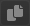

import TOCInline from '@theme/TOCInline';


# Gradient Step Panel

<hr/>

Gradient Step Panel은 선택한 layer(gradient)의 ```step```에 대한 편집기능을 제공합니다.
:::info
* layer는 ```step 리스트```로 구성됩니다.
:::

<hr/>


<TOCInline toc={toc}/>

<hr/>

## Preview


그라디언트 ```step```을 linear-gradient 형태로 미리볼수 있습니다.


<hr/>

## Start offset


그라디언트가 실제 적용될때 ```시작 스텝```에 대한 ```오프셋값```을 설정합니다.
:::info
- 프리뷰에서는 적용되지 않습니다.
- px : ```절대적인``` 위치입니다.
- % : 컨테이너, 레이어 사이즈 상태에 따른 ```상대적인``` 위치입니다.
:::


<hr/>

## Step helper


```step layer``` 편집을 위한 헬퍼 모음입니다.
 -   **add preset**
	- ```step list```를 ```local preset```에 저장합니다.

 -  **sort steps**
	- ```step list```내 아이템을 step 값을 기준으로 ```정렬합니다```.

 -  **reverse steps**
   - ```step list```내 아이템을 step 값을 기준으로 ```반전시킵니다```.

 -  **add step**
	 - ```step list```내 새로운 step을 ```추가합니다.```

<hr/>

## Step layer


```step value``` 설정 레이어. step의 ```색상```, ```위치```, ```위치 유닛```을 편집할 수 있습니다.

 -  **mode**
   - 단일 ```step```은  ```single```/```range``` mode를 지원합니다.

	  |||
	  |:--|--:|
	  |Single Mode|Range Mode|

 -  **delete**
	 - step layer ```삭제``` 기능을 제공합니다.

 -  **duplicate**
	 - step layer ```복제``` 기능을 제공합니다.


 -   **divide**
	  - ```step``` 위치에서 그라디언트를 멈출 것인지 설정 합니다.

		|||
		|:--|--:|
		|divide 미사용|divide 사용|

 -  **color**
 	  - step layer ```컬러```를 설정합니다.

 - **unit**
	:::info
	- px : ```절대적인``` 위치입니다.
	- % : ```상대적인``` 위치입니다.
	- auto : 앞/뒤 step에 따른 ```자동 계산```된 위치 입니다.
	:::

<hr/>

## Step layer Drag Drop
Drag & Drop으로 step간의 순서를 변경할수 있습니다.


