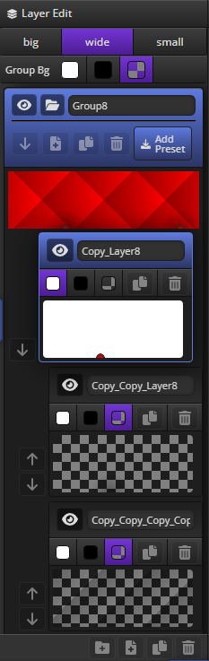
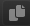
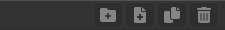
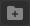
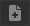

import ReactPlayer from 'react-player'
import Tabs from '@theme/Tabs';
import TabItem from '@theme/TabItem';
import TOCInline from '@theme/TOCInline';

# Layer Panel

<hr/>

Layer Panel은 해당 컨테이너에 속해있는 ```group```과 ```layer```의 ```생성```, ```삭제```, ```이동```, ```복제```에 대한 기능을 제공합니다.

:::info
단축키 : ```F2``` 키를 통해 ```on/off``` 할 수 있습니다.
:::




<hr/>

<TOCInline toc={toc}/>

<hr/>

## Group & Layer Preview Size
그룹과 레이어 프리뷰 사이즈를 설정합니다.
<Tabs>
	<TabItem value="big" label="big" default>
		<div style={{
			display: 'flex',
			flexDirection: 'column',
			width: 'fit-content',
			gap: '2px',
			background: '#333',
			borderRadius: '8px',
			padding: '5px 4px 0px'
		}}>
			
			
		</div>
	</TabItem>
	<TabItem value="wide" label="wide">
		<div style={{
			display: 'flex',
			flexDirection: 'column',
			width: 'fit-content',
			gap: '2px',
			background: '#333',
			borderRadius: '8px',
			padding: '5px 4px 0px'
		}}>
			
			
		</div>
	</TabItem>
	<TabItem value="small" label="small">
		<div style={{
			display: 'flex',
			flexDirection: 'column',
			width: 'fit-content',
			gap: '2px',
			background: '#333',
			borderRadius: '8px',
			padding: '5px 4px 0px'
		}}>
			
			
		</div>
	</TabItem>
</Tabs>


<hr/>

## Group Preview Background Color
그룹 프리뷰 배경 컬러를 설정합니다.

<Tabs>
	<TabItem value="white" label="white" default>
		<div style={{
			display: 'flex',
			flexDirection: 'column',
			width: 'fit-content',
			gap: '2px',
			background: '#333',
			borderRadius: '8px',
			padding: '5px 4px 0px'
		}}>
			
			
		</div>
	</TabItem>
	<TabItem value="black" label="black">
		<div style={{
			display: 'flex',
			flexDirection: 'column',
			width: 'fit-content',
			gap: '2px',
			background: '#333',
			borderRadius: '8px',
			padding: '5px 4px 0px'
		}}>
			
			
		</div>
	</TabItem>
	<TabItem value="transparent" label="transparent">
		<div style={{
			display: 'flex',
			flexDirection: 'column',
			width: 'fit-content',
			gap: '2px',
			background: '#333',
			borderRadius: '8px',
			padding: '5px 4px 0px'
		}}>
			
			
		</div>
	</TabItem>
</Tabs>

:::info
**결과 Css에는 적용되지 않습니다.**
:::

<hr/>

## Group Item
- ####   visible
  - 그룹의 ```Visible``` 여부를 설정합니다.
  - ```off``` 상태시 Viewport Window내에 적용되지 않으며 결과 Css도 생성되지 않습니다.

<hr/>

- ####   group open/close
  - 그룹의 레이어 리스트를 ```축소 표시``` 여부를 설정합니다.

<hr/>

- ####  group label
  - 그룹의 ```라벨```을 설정합니다.

<hr/>

- ####  add layer
  - 그룹의 레이어를 ```추가```합니다.

<hr/>

- ####  duplicate group
  - 그룹을 ```복제```합니다.

<hr/>

- ####  delete group
  - 그룹을 ```삭제```합니다.

<hr/>

- ####  add preset
  - 그룹을 ```User Preset```에 저장합니다.

<hr/>

## Layer Item
- ####    visible
  - 레이어 ```Visible``` 여부를 설정합니다.
  - ```off``` 상태시 Viewport Window내에 적용되지 않으며 결과 Css도 생성되지 않습니다.

<hr/>

- ####  layer label
	- 레이어 ```라벨```을 설정합니다.

<hr/>


- #### preview bg color
레이어 프리뷰 배경 컬러를 설정합니다.
<Tabs>
	<TabItem value="white" label="white" default>
		
	</TabItem>
	<TabItem value="black" label="black">
		
	</TabItem>
	<TabItem value="transparent" label="transparent">
		
	</TabItem>
</Tabs>

:::info
**결과 Css에는 적용되지 않습니다.**
:::

<hr/>

- ####  duplicate layer
  - 레이어를 ```복제```합니다.

<hr/>

- ####  delete layer
  - 레이어를 ```삭제```합니다.

<hr/>


## Bottom Menu


- ####  add group
  그룹을 ```추가```합니다.

<hr/>

- ####  add layer
	레이어를 ```추가```합니다.

<hr/>

- ####  duplicate layer
	레이어를 ```복제```합니다.

<hr/>

- ####  delete layer
	레이어를 ```삭제```합니다.

<hr/>


## Drag & Drop
- Group간 Drag & Drop 지원
- Layer간 Drag & Drop 지원

<ReactPlayer
	playing
	controls
	url={require('@site/static/video/RedGradient_CssGradientEditor-dragdrop.mp4').default}
	loop
	width={'100%'}
	height={'100%'}
	playbackRate={1}
/>
<hr/>