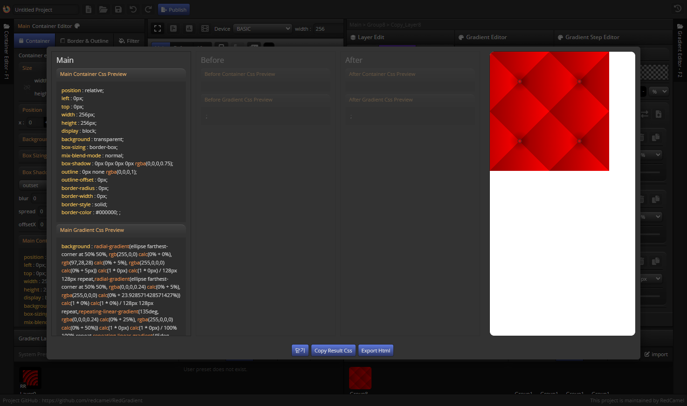

import TOCInline from '@theme/TOCInline';

# Menu Bar

<hr/>

최상단 글로벌 Top Menu

<hr/>

<TOCInline toc={toc}/>

<hr/>

### project name edit

- 프로젝트 이름을 수정 할 수 있습니다.
- 프로젝트를 저장할때 기본 이름으로 지정됩니다.

<hr/>

### project save/load

- #### 프로젝트를 생성/저장/로드 할 수 있습니다. ####

:::info
- 생성 : ```ALT + N```
- 저장 : ```CTR + S```
- 로드 : ```CTR + O```
:::


- #### undo/redo ####

:::info
- undo : ```CTR + Z```
- redo : ```CTR + SHIFT +Z```
:::

<hr/>

### project publish

- 프로젝트 결과를 HTML로 다운받거나 Css 결과를 복사 할 수 있습니다.



<hr/>
