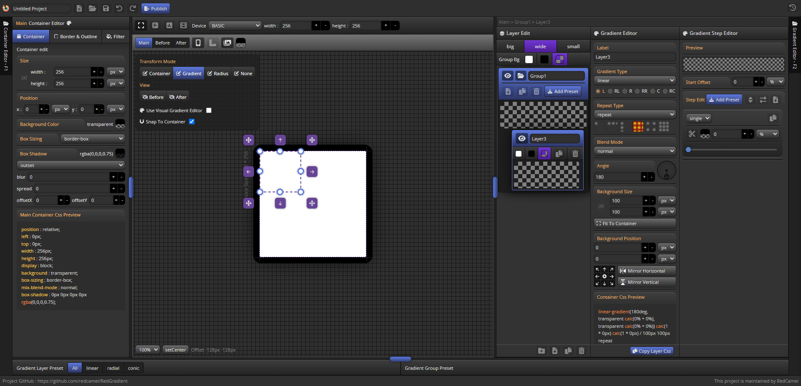

# Interface Overview

RedGradient 인터페이스는 크게 전역메뉴, 컨테이너 에디터, 그라디언트 에디터, 상태 정보 및 장면을 보고 작업하는 뷰포트로 구성됩니다 .

## Menu Bar
  - [project name edit](menuBar#project-name-edit)
  - [project save/load](menuBar#project-saveload)
  - [project publish](menuBar#project-publish)

## Container Tab
  - [Container panel](container/container/)
  - [Border & Outline panel](container/borderOutline)
  - [Filter panel](container/filter)

