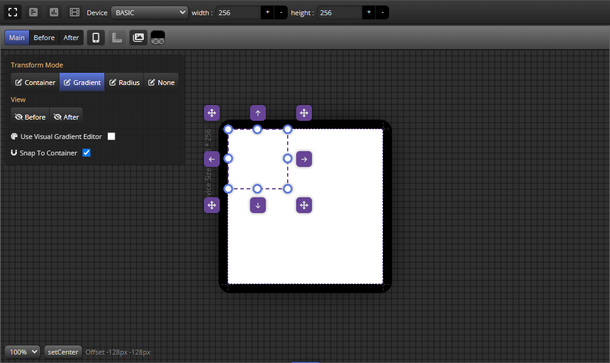

import TOCInline from '@theme/TOCInline';

# Viewport UI Layout

<TOCInline toc={toc}/>

Viewport는 Viewport Window의 모음으로 구성되어집니다.

Viewport는 다음과 같이 영역 구분됩니다.
- [Frame menu bar](viewportTopMenu) : Viewport Window 레이아웃을 설정 / 가상 Device의 크기를 설정 할 수 있습니다.
- [Viewport window](viewportWindow) :  실제 컨테이너와 그라디언트 에디트 영역

