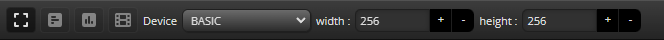
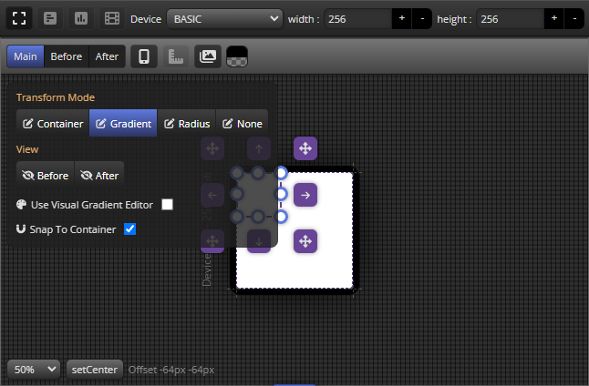
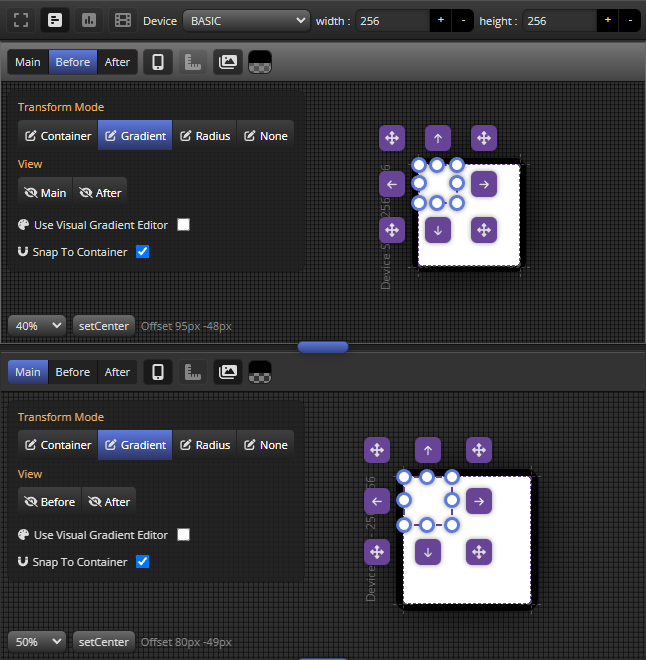
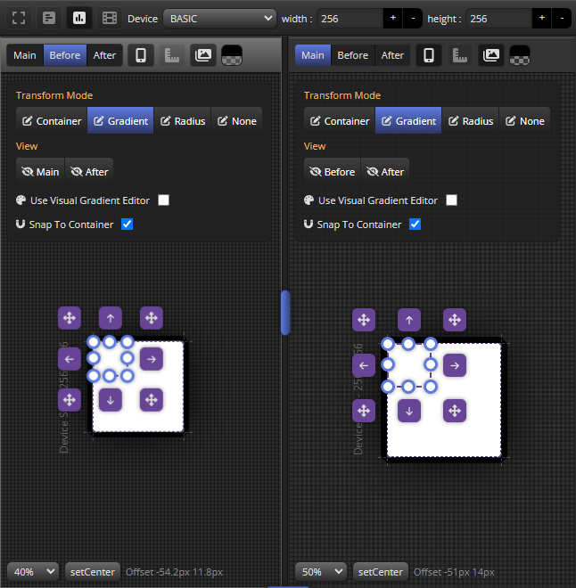
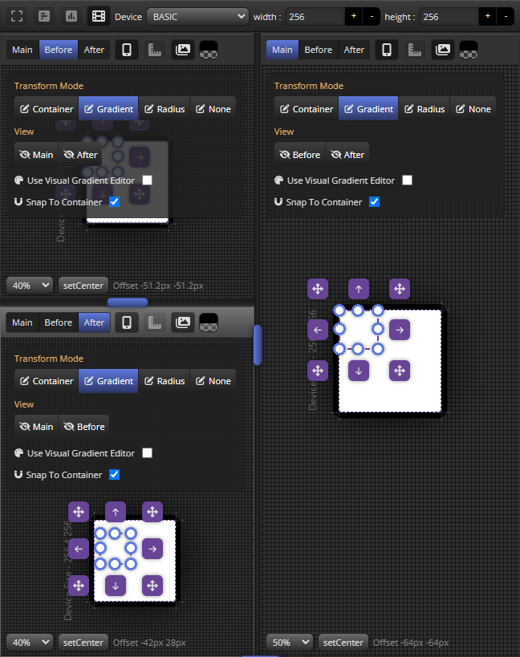

import TOCInline from '@theme/TOCInline';

# Viewport frame menu bar

Viewport 는 Viewport Window로 구성되어집니다.

이 메뉴 바에서는 Viewport window layout을 설정하고 device 크기정보를 설정할 수 있습니다.

<TOCInline toc={toc}/>

## Setting Viewport window layout

사용자 편의에 따라 4가지 레이아웃으로 뷰포트 구성을 할 수 있습니다.

### Single Mode

### Vertical Mode

### Horizontal Mode

### Triple Mode

## Device Size Edit
Device는 Viewport window에 Container를 실제 디바이스 사이즈에서 확인할수있는 가상의 영역입니다.

Size Preset과 사용자 입력 기반 설정을 지원합니다.

