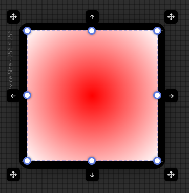
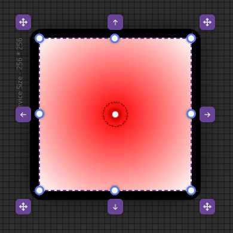
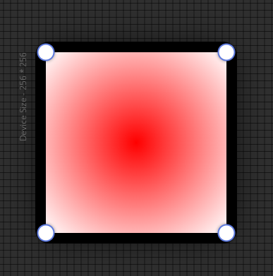

import TOCInline from '@theme/TOCInline';

# Viewport Window

<hr/>

Viewport Window

<hr/>

<TOCInline toc={toc}/>

<hr/>

## Viewport Window Menu

- #### 해당 뷰포트가 편집해야할 container를 지정합니다.
	- Before Container
	- Main Container
	- After Container


- #### 개별 Viewport Window의 view 상태를 설정합니다.
  - Device Visible
	- Ruler Visible
	- Allow Overflow
  - Container Background Color

<hr/>

## Transform Mode UI

### Container Mode
```text
컨테이너 사이즈를 마우스 + 키보드를 통해 수정 할 수 있습니다.
```
- 단축키 : ```CTR + 1```
- move
- resize



### Gradient Mode
```text
그라디언트 사이즈를 마우스 + 키보드를 통해 수정 할 수 있습니다.
```
- 단축키 : ```CTR + 2```
- move
- resize



### Radius Mode
```text
컨테이더의 border-radius를 마우스를 통해 수정 할 수 있습니다.
```
- 단축키 : ```CTR + 3```



### None Mode
```text
Transform Editor 없이 현재 상태를 확인하고 싶을때 None 모드를 사용합니다.
```
- 단축키 : ```CTR + 4```

<hr/>


## With View

<hr/>


## Visual Gradient editor

<hr/>


## Snap to container

