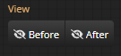

import Tabs from '@theme/Tabs';
import TabItem from '@theme/TabItem';
import TOCInline from '@theme/TOCInline';
import ReactPlayer from 'react-player'
const t0 = require('@site/static/video/RedGradient_CssGradientEditor-transformContainer.mp4').default
const t1 = require('@site/static/video/RedGradient_CssGradientEditor-transformGradient.mp4').default
const t2 = require('@site/static/video/RedGradient_CssGradientEditor-transformRadius.mp4').default


# Viewport Window

<hr/>

```Viewport Window```는 실제 그라디언트를 화면상에 편집하기 위한 공간입니다.

개별 뷰포트는 수정 할 Container 선택하고 해당 컨테이너를 기반으로 편집을 수행합니다.

<hr/>

<TOCInline toc={toc}/>

<hr/>

## Viewport Window Menu

- #### 해당 뷰포트가 편집해야할 container를 지정합니다.
  - **Before** Container : css상의 ```::before``` 공간을 의미합니다.

		
  - **Main** Container : css를 표현할 ```메인 Dom```

		
  - **After** Container : css상의 ```::after``` 공간을 의미합니다.

		

:::info
RedGradient는 ```하나의 Dom에 표현될 그라디언트```를 편집합니다.
메인 Dom을 ```Main Container```로 선언합니다.
:::


- #### 개별 Viewport Window의 view 상태를 설정합니다.
  - **Device** Visible : ```가상 디바이스``` 표현 유무를 설정합니다.

		
		
	- **Ruler** Visible :  ```가상 Ruler```의 표현 유무를 설정합니다.

		
		
	- Allow **Overflow** : 가상 디바이스 사이즈내로 ```overflow 허용 유무```를 설정합니다.

		
		
  - Container **Background Color** : 편집중인 ```Container의 배경색```을 설정합니다.

		

<hr/>

## Edit Helper UI


개별 viewport window는 편집 편의를 위한 다양한 모드를 지원합니다.

<hr/>

## Transform Mode Helper
- 해당 레이어의 **편집 타겟을 설정**합니다.
  - ```container```
  - ```gradient```
  - ```border```
  - ```none```

### Container Mode
- 컨테이너 사이즈를 ```마우스 + 키보드```를 통해 수정 할 수 있습니다.

:::info
단축키 : ```CTR + 1```
:::

[//]: # (![ui_transform_container]&#40;./img/ui_transform_container.png&#41;)
<ReactPlayer
	playing
	controls
	url={t0}
	loop
	width={'100%'}
	height={'100%'}
	playbackRate={1.5}
/>

### Gradient Mode
- 그라디언트 사이즈를 ```마우스 + 키보드```를 통해 수정 할 수 있습니다.

:::info
단축키 : ```CTR + 2```
:::

[//]: # (![ui_transform_gradient]&#40;./img/ui_transform_gradient.png&#41;)
<ReactPlayer
	playing
	controls
	url={t1}
	loop
	width={'100%'}
	height={'100%'}
	playbackRate={1.5}
/>

### Radius Mode
- 컨테이더의 border-radius를 ```마우스```를 통해 수정 할 수 있습니다.

:::info
단축키 : ```CTR + 3```
:::

[//]: # (![ui_transform_radius]&#40;./img/ui_transform_radius.png&#41;)
<ReactPlayer
	playing
	controls
	url={t2}
	loop
	width={'100%'}
	height={'100%'}
	playbackRate={1.5}
/>

### None Mode
- Transform Editor 없이 현재 상태를 확인하고 싶을때 ```None 모드```를 사용합니다.

:::info
단축키 : ```CTR + 4```
:::

<hr/>


## With View


- 현재 편집하고있는 대상 Container이외에 다른 컨테이너를 같이 보고 싶은 컨테이너를 설정합니다.
- TODO with view 동영상 추가

:::info
```with view```에 설정된 container는 ```현재 뷰포트 윈도우에서 수정할 수 없습니다.```
:::
<hr/>


## Visual Gradient editor
- 그라디언트 ```비쥬얼 편집기를 사용할지 여부```를 설정합니다.
- 사용 설정시 현재 선택한 레이어의 타입에 따른 편집기를 제공합니다.
- TODO 편집화면 추가
<hr/>


## Snap to container
- 그라디언트 사이즈 & 위치 변경시 ```container의 경계```에 ```snap``` 시킬지 여부를 설정합니다.
- TODO snap 동영상 추가

