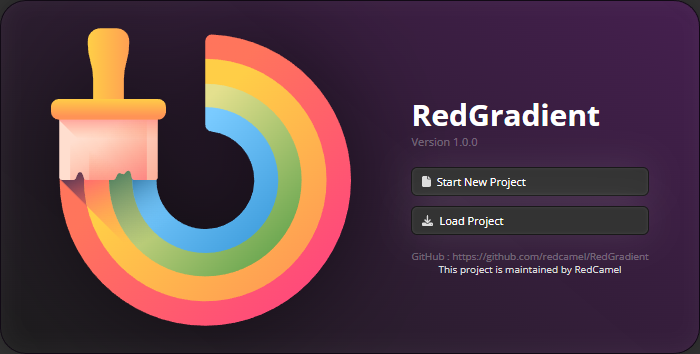
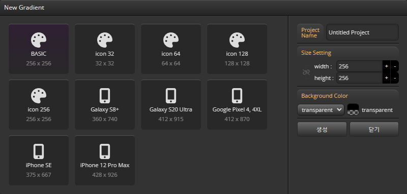

import ReactPlayer from 'react-player'

<ReactPlayer playing controls url='./img/video/newProject.mp4'/>

# Create your first Project

## 프로젝트 관리

  - ### 두가지 프로젝트 시작 모드를 지원합니다.
- 새로운 프로젝트로 시작하기
- 기존 프로젝트로 시작하기

## 새 프로젝트 만들기

   - ### 프로젝트 생성 옵션
- 프로젝트 이름 설정
- 프리뷰 디바이스 크기 프리셋
- 프로젝트 크기 설정
- 초기 background 컬러

## Main UI

